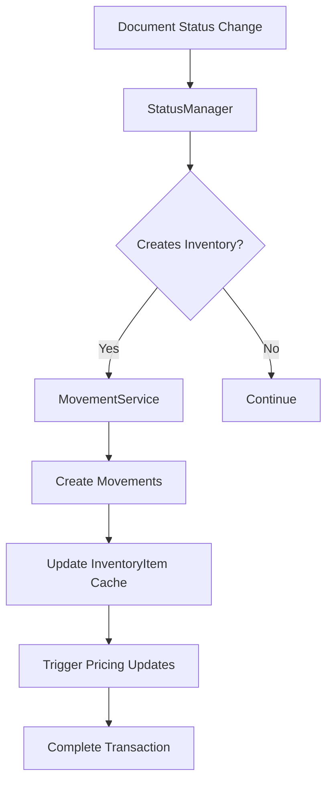

# OptimaPOS System Overview

## 🎯 Executive Summary

**OptimaPOS** is an enterprise-grade point-of-sale and inventory management system built with Django, designed for complex retail/wholesale operations. The system features a modular architecture with sophisticated document workflows, real-time inventory tracking, multi-tier pricing, and comprehensive partner management.

## 📋 Table of Contents

1. [System Architecture](#system-architecture)
2. [Core Philosophy](#core-philosophy)
3. [Application Overview](#application-overview)
4. [Key Features](#key-features)
5. [Integration Architecture](#integration-architecture)
6. [Data Flow](#data-flow)
7. [Technology Stack](#technology-stack)
8. [Deployment Architecture](#deployment-architecture)
9. [Security & Performance](#security--performance)
10. [Development Guidelines](#development-guidelines)

---

## System Architecture

```
OptimaPOS System Architecture:

┌─────────────────────────────────────────────────────────────────┐
│                          FRONTEND LAYER                        │
│  Web Interface • POS Terminal • Mobile App • Admin Panel       │
└─────────────────────────┬───────────────────────────────────────┘
                         │
┌─────────────────────────┴───────────────────────────────────────┐
│                       BUSINESS LOGIC LAYER                     │
│                                                                 │
│  ┌─────────────┐  ┌─────────────┐  ┌─────────────┐             │
│  │ PURCHASES   │  │    SALES    │  │   REPORTS   │             │
│  │ Document    │  │ Order Mgmt  │  │ Analytics   │             │
│  │ Workflow    │  │ & POS       │  │ & BI        │             │
│  └─────────────┘  └─────────────┘  └─────────────┘             │
│                          │                                      │
│  ┌─────────────┐  ┌─────────────┐  ┌─────────────┐             │
│  │ NOMENCLATURES│  │ INVENTORY   │  │  PRICING    │             │
│  │ Document     │  │ Real-time   │  │ Multi-tier  │             │
│  │ Management   │  │ Tracking    │  │ Strategy    │             │
│  └─────────────┘  └─────────────┘  └─────────────┘             │
│                          │                                      │
│  ┌─────────────┐  ┌─────────────┐  ┌─────────────┐             │
│  │  PRODUCTS   │  │  PARTNERS   │  │    CORE     │             │
│  │ Catalog &   │  │ Customer &  │  │ Foundation  │             │
│  │ Lifecycle   │  │ Supplier    │  │ Services    │             │
│  └─────────────┘  └─────────────┘  └─────────────┘             │
└─────────────────────────┬───────────────────────────────────────┘
                         │
┌─────────────────────────┴───────────────────────────────────────┐
│                        DATA ACCESS LAYER                       │
│  Django ORM • Database Migrations • Query Optimization         │
└─────────────────────────┬───────────────────────────────────────┘
                         │
┌─────────────────────────┴───────────────────────────────────────┐
│                       INFRASTRUCTURE LAYER                     │
│  PostgreSQL Database • Redis Cache • File Storage • Logging    │
└─────────────────────────────────────────────────────────────────┘
```

### Modular Design Principles

- **🏗️ Layered Architecture** - Clear separation of concerns
- **🔄 Event-Driven** - Status changes trigger inventory movements  
- **📊 Configuration-Based** - Business rules defined in configuration
- **⚡ Performance-First** - Optimized queries and caching
- **🔒 Security-Aware** - Role-based access and data validation

---

## Core Philosophy

### 1. **Result Pattern** - Consistent Error Handling

All business operations return `Result` objects instead of throwing exceptions:

```python
from core.utils.result import Result

def business_operation():
    if validation_fails:
        return Result.error('VALIDATION_FAILED', 'Details here')
    return Result.success(data={'result': 'success'})

# Usage
result = business_operation()
if result.ok:
    process_success(result.data)
else:
    handle_error(result.code, result.msg)
```

### 2. **Interface-Driven Design**

Core interfaces ensure consistent APIs across implementations:

```python
from core.interfaces import IDocumentService, ILocation

class MyService(IDocumentService):
    def create_document(self, model_class, data, user, location) -> Result:
        # Implementation here
        pass
```

### 3. **Configuration Over Code**

Business rules defined in database configuration:

```python
# Status transitions trigger inventory movements
class DocumentTypeStatus:
    creates_inventory_movements = BooleanField()
    reverses_inventory_movements = BooleanField()
    allows_movement_correction = BooleanField()
```

### 4. **Thin Wrapper Pattern**

App-specific services delegate to core services:

```python
class PurchaseDocumentService:
    def __init__(self, document=None, user=None):
        self.facade = DocumentService(document, user)  # Delegate everything
    
    def approve(self, comments=''):
        return self.facade.transition_to('approved', comments)
```

---

## Application Overview

### **CORE** - Foundation Infrastructure
- **Purpose**: Base models, utilities, interfaces, Result pattern
- **Key Components**: Result class, IDocumentService, ILocation, base models
- **Dependencies**: None (foundation layer)

### **NOMENCLATURES** - Document Management Hub  
- **Purpose**: Classification system and document workflow engine
- **Key Components**: DocumentService facade, StatusManager, Brand/ProductGroup
- **Key Features**: Status-driven workflows, integrated validation, movement triggers

### **PRODUCTS** - Product Catalog
- **Purpose**: Product definitions with lifecycle management  
- **Key Components**: Product model, packaging system, barcode/PLU support
- **Key Features**: Lifecycle states, unit conversions, enterprise product creation

### **INVENTORY** - Stock Management
- **Purpose**: Real-time inventory tracking with FIFO and batch support
- **Key Components**: InventoryMovement (source of truth), InventoryItem (cache)
- **Key Features**: Document-driven movements, FIFO/batch tracking, profit analysis

### **PRICING** - Multi-Tier Pricing
- **Purpose**: Sophisticated pricing with customer groups and promotions
- **Key Components**: ProductPrice, group pricing, promotional pricing
- **Key Features**: Cost-based pricing, location-specific pricing, barcode pricing

### **PARTNERS** - Business Relationships
- **Purpose**: Customer and supplier management with schedules and credit
- **Key Components**: Customer/Supplier models, sites, schedules  
- **Key Features**: Credit management, delivery schedules, multi-site support

### **PURCHASES** - Procurement Workflow
- **Purpose**: Purchase document lifecycle (Request → Order → Delivery)
- **Key Components**: PurchaseDocumentService (thin wrapper), document conversion
- **Key Features**: Document conversions, integrated validation, inventory integration

---

## Key Features

### 🏢 **Enterprise Document Workflow**
```
Purchase Request → Purchase Order → Delivery Receipt
     ↓                  ↓              ↓
  Planning           Commitment    Inventory Update
  
Status transitions automatically:
• Create inventory movements
• Update costs and pricing  
• Trigger business rules
• Validate constraints
```

### 📊 **Real-Time Inventory Management**
- **Movement-Centric**: All changes tracked as movements
- **FIFO/Batch Support**: Automatic lot tracking with expiry dates
- **Multi-Location**: Products tracked across warehouses/stores
- **Profit Tracking**: Cost and sale price per movement for profit analysis

### 💰 **Multi-Tier Pricing System**
```
Pricing Priority: Promotion → Customer Group → Step Price → Base Price → Fallback

• Location-specific pricing
• Customer group discounts
• Quantity-based step pricing  
• Time-limited promotions
• Cost-based markup calculations
```

### 🏷️ **Advanced Product Management**
- **Lifecycle Management**: NEW → ACTIVE → PHASE_OUT → DISCONTINUED → ARCHIVED
- **Multi-Unit Support**: Base units + packaging configurations
- **Barcode/PLU Integration**: Product and packaging barcodes
- **Validation Engine**: Business rule validation and consistency checks

### 👥 **Comprehensive Partner Management**
- **Customer Management**: Credit limits, price groups, delivery schedules
- **Supplier Management**: Payment terms, divisions, delivery schedules  
- **Multi-Site Support**: Multiple locations per customer
- **Schedule Integration**: Weekly delivery/ordering schedules

### ⚙️ **Configuration-Driven Operations**
- **Status Configuration**: Document behavior defined in database
- **Business Rules**: Configurable validation and constraints
- **Flexible Workflows**: Status transitions drive system behavior
- **Location Policies**: Per-location inventory and pricing rules

---

## Integration Architecture

### Document-Driven Integration



### Service Integration Pattern

```python
# Cross-app service integration
class DocumentService:
    def transition_to(self, new_status, comments=''):
        # 1. Validate transition
        # 2. Update document status
        # 3. Check configuration
        if self.status_config.creates_inventory_movements:
            movement_result = MovementService.process_document_movements(self.document)
        # 4. Update pricing if needed
        # 5. Log audit trail
```

### Event Flow Architecture

```
User Action → Service Call → Validation → Business Logic → Integration
     ↓              ↓           ↓            ↓             ↓
Create Order → DocumentService → StatusManager → MovementService → InventoryItem
     ↓              ↓           ↓            ↓             ↓  
   Result ← Result Pattern ← Configuration ← FIFO Logic ← Cache Update
```

---

## Data Flow

### 1. **Purchase Document Lifecycle**

```
1. Create Purchase Request
   ├─ PurchaseDocumentService.create_document('request', ...)
   ├─ DocumentService.validate_for_purchase_creation()
   ├─ Create instance → Setup via facade → Add lines
   └─ Status: 'draft' (no inventory movements)

2. Approve Request  
   ├─ facade.transition_to('approved', comments)
   ├─ StatusManager checks configuration
   ├─ No inventory movements for requests
   └─ Status: 'approved'

3. Convert to Purchase Order
   ├─ convert_to_order(expected_delivery_date=...)
   ├─ Create new PurchaseOrder with lines from request
   ├─ Mark request as 'converted'
   └─ Status: 'draft' → can be approved

4. Complete Delivery Receipt
   ├─ facade.transition_to('completed', comments)  
   ├─ StatusManager: creates_inventory_movements=True
   ├─ MovementService.process_document_movements()
   ├─ Create INCOMING movements for each line
   ├─ Update InventoryItem cache
   └─ Inventory updated with received goods
```

### 2. **Inventory Movement Flow**

```
Document Line Data:
├─ Product: WIDGET001
├─ Quantity: 100 pieces  
├─ Unit Price: $12.50
├─ Batch: AUTO_WIDGET001_20241201_WH01
└─ Expected Delivery: 2024-12-01

Movement Creation:
├─ Type: 'IN' (incoming)
├─ Effective Quantity: +100 (positive for incoming)
├─ Cost Price: $12.50
├─ Batch Tracking: Auto-generated batch
├─ Document Reference: DOC25082919465976
└─ Location: WH01

InventoryItem Update:
├─ current_qty: 500 → 600
├─ avg_cost: recalculated weighted average
├─ last_movement_date: updated
└─ last_purchase_cost: $12.50
```

### 3. **Pricing Integration Flow**

```
Pricing Request:
├─ Location: Warehouse A
├─ Product: WIDGET001  
├─ Customer: ACME Corp (VIP group)
├─ Quantity: 50 pieces
└─ Date: Today

Pricing Resolution:
├─ Check promotional pricing → None active
├─ Check customer group pricing → VIP: $22.00
├─ Check step pricing → 50+ units: $21.50  
├─ Check base price → $24.99
├─ Check fallback → cost + markup
└─ Final: $21.50 (step pricing wins)

Cost Integration:
├─ Get cost from InventoryItem.avg_cost
├─ Calculate profit: $21.50 - $15.00 = $6.50
├─ Calculate margin: $6.50 / $21.50 = 30.2%
└─ Return complete pricing data
```

### 4. **Status-Configuration Flow**

```
Document Status Change Request:
├─ Document: DeliveryReceipt DOC123
├─ Current Status: 'draft'  
├─ Target Status: 'completed'
└─ User: john.doe

Configuration Lookup:
├─ DocumentType: 'DELIVERY'
├─ Status: 'completed' 
├─ Config Found: creates_inventory_movements=True
└─ Config Found: reverses_inventory_movements=False

Processing:
├─ Update document status
├─ Create inventory movements (per configuration)
├─ Update inventory cache
├─ Log status change with timestamp
└─ Return success result
```

---

## Technology Stack

### **Backend Framework**
- **Django 4.2+** - Web framework with ORM
- **Django REST Framework** - API development
- **Python 3.10+** - Core language

### **Database & Caching**
- **PostgreSQL 14+** - Primary database with JSON support
- **Redis 6+** - Caching and session storage  
- **Connection Pooling** - Optimized database connections

### **Infrastructure**
- **Docker & Docker Compose** - Containerization
- **Nginx** - Reverse proxy and static file serving
- **Celery** - Asynchronous task processing
- **RabbitMQ/Redis** - Message broker

### **Monitoring & Logging**
- **Sentry** - Error tracking and performance monitoring
- **Prometheus + Grafana** - Metrics and dashboards
- **ELK Stack** - Centralized logging
- **Django Debug Toolbar** - Development profiling

### **Development Tools**
- **Git** - Version control
- **pytest** - Testing framework
- **Black + isort** - Code formatting
- **pre-commit** - Code quality hooks

---

## Deployment Architecture

### **Production Environment**

```
┌─────────────────────┐    ┌─────────────────────┐
│   Load Balancer     │    │     CDN             │
│   (nginx/HAProxy)   │    │   (Static Assets)   │
└──────────┬──────────┘    └─────────────────────┘
           │
┌──────────┴──────────┐
│  Application Servers│
│  ┌─────────────────┐│    ┌─────────────────────┐
│  │ Django App 1    ││    │     Redis Cluster   │
│  │ (Web + API)     ││    │   (Cache + Sessions)│
│  └─────────────────┘│    └─────────────────────┘
│  ┌─────────────────┐│
│  │ Django App 2    ││    ┌─────────────────────┐
│  │ (Web + API)     ││    │   PostgreSQL        │  
│  └─────────────────┘│    │   (Master + Replica)│
└─────────────────────┘    └─────────────────────┘

┌─────────────────────┐    ┌─────────────────────┐
│   Celery Workers    │    │   Message Broker    │
│ ┌─────────────────┐ │    │   (RabbitMQ/Redis)  │
│ │ Background Tasks│ │    └─────────────────────┘
│ └─────────────────┘ │
│ ┌─────────────────┐ │    ┌─────────────────────┐
│ │ Report Generator│ │    │   File Storage      │
│ └─────────────────┘ │    │   (S3/MinIO)        │
└─────────────────────┘    └─────────────────────┘
```

### **Development Environment**

```yaml
# docker-compose.yml structure
services:
  web:          # Django application
  db:           # PostgreSQL database
  redis:        # Cache and sessions  
  celery:       # Background tasks
  mailhog:      # Email testing
  nginx:        # Reverse proxy
```

### **Scalability Considerations**

- **Horizontal Scaling**: Multiple app servers behind load balancer
- **Database Scaling**: Read replicas and connection pooling  
- **Cache Strategy**: Redis cluster with failover
- **File Storage**: Distributed storage (S3/MinIO)
- **Task Processing**: Celery workers with auto-scaling

---

## Security & Performance

### **Security Measures**

```python
# Authentication & Authorization
- Django's built-in authentication system
- Permission-based access control
- CSRF protection enabled
- Secure cookie settings
- HTTPS enforcement

# Data Protection  
- SQL injection prevention (Django ORM)
- XSS protection (template escaping)
- Input validation and sanitization
- Sensitive data encryption
- Audit trails for critical operations
```

### **Performance Optimization**

```python
# Database Optimization
- Query optimization with select_related/prefetch_related
- Database indexes on critical fields
- Connection pooling
- Query monitoring and profiling

# Caching Strategy
- Redis for session storage
- Query result caching
- Template fragment caching  
- API response caching
- Cache invalidation patterns

# Application Performance
- Lazy loading of related data
- Pagination for large datasets
- Background processing for heavy tasks
- Optimized serializers
- Asset compression and CDN
```

### **Monitoring & Alerting**

- **Performance Monitoring**: Response times, throughput, error rates
- **Resource Monitoring**: CPU, memory, disk usage, database connections
- **Business Metrics**: Order processing, inventory accuracy, system health
- **Error Tracking**: Real-time error reporting and alerting
- **Uptime Monitoring**: Service availability and response times

---

## Development Guidelines

### **Code Quality Standards**

```python
# Result Pattern Usage
def business_operation() -> Result:
    try:
        # Business logic here
        return Result.success(data={'result': 'data'})
    except Exception as e:
        return Result.error('OPERATION_FAILED', str(e))

# Service Implementation
class MyService(IServiceInterface):
    def required_method(self, params) -> Result:
        # Always implement interface methods
        pass

# Validation Pattern  
def validate_input(data):
    if not data.get('required_field'):
        return Result.error('VALIDATION_FAILED', 'Field required')
    return Result.success()
```

### **Testing Strategy**

```python
# Unit Tests
- Test all service methods
- Test Result pattern responses
- Test validation logic
- Mock external dependencies

# Integration Tests
- Test document workflows
- Test inventory movements  
- Test pricing calculations
- Test status transitions

# Performance Tests
- Database query performance
- API response times
- Concurrent user handling
- Memory usage patterns
```

### **Documentation Requirements**

- **API Documentation**: OpenAPI/Swagger specs for all endpoints
- **Code Documentation**: Docstrings for all public methods
- **Architecture Documentation**: System design and integration points
- **Deployment Documentation**: Environment setup and configuration
- **User Documentation**: Feature guides and troubleshooting

### **Version Control & Deployment**

```bash
# Development Workflow
1. Feature branch from main
2. Implement feature with tests
3. Code review and approval  
4. Merge to main
5. Automated deployment to staging
6. QA testing and approval
7. Production deployment

# Release Process
- Semantic versioning (MAJOR.MINOR.PATCH)
- Database migration planning
- Rollback procedures
- Feature flags for gradual rollouts
```

---

## System Benefits

### **For Business Users**
- **Real-Time Inventory**: Accurate stock levels across all locations
- **Automated Workflows**: Document status drives business processes
- **Flexible Pricing**: Support for complex pricing strategies
- **Comprehensive Reporting**: Profit analysis and business intelligence
- **Partner Management**: Complete customer and supplier lifecycle

### **For Developers**
- **Modular Architecture**: Clean separation of concerns
- **Consistent APIs**: Result pattern and interface-driven design
- **Extensive Documentation**: Comprehensive guides for each component
- **Testing Framework**: Built-in testing patterns and tools
- **Performance Optimized**: Query optimization and caching strategies

### **For System Administrators**
- **Scalable Deployment**: Horizontal scaling capabilities
- **Monitoring & Alerting**: Comprehensive system health monitoring
- **Security Features**: Built-in security best practices
- **Backup & Recovery**: Database backup and restore procedures
- **Configuration Management**: Environment-specific configurations

---

## Future Roadmap

### **Short Term (Q1-Q2 2025)**
- Mobile POS application
- Advanced reporting dashboard
- API rate limiting and throttling
- Enhanced audit logging
- Performance optimization phase 2

### **Medium Term (Q3-Q4 2025)**  
- Multi-tenant architecture
- Advanced analytics with ML
- Integration with external systems (accounting, CRM)
- Automated testing pipeline expansion
- Microservices migration planning

### **Long Term (2026+)**
- Cloud-native deployment (Kubernetes)
- Real-time analytics with streaming data
- AI-powered demand forecasting
- Advanced security features (2FA, SSO)
- International localization support

---

## Getting Started

### **Development Setup**
1. Clone repository and setup virtual environment
2. Install dependencies: `pip install -r requirements.txt`
3. Setup database: `python manage.py migrate`
4. Load sample data: `python manage.py loaddata fixtures/`
5. Run development server: `python manage.py runserver`

### **Key Documentation**
- [CORE App Documentation](CORE_APP.md) - Foundation services
- [NOMENCLATURES App Documentation](NOMENCLATURES_APP.md) - Document management
- [INVENTORY App Documentation](INVENTORY_APP.md) - Stock management
- [PRICING App Documentation](PRICING_APP.md) - Pricing strategies
- [PARTNERS App Documentation](PARTNERS_APP.md) - Customer/supplier management  
- [PRODUCTS App Documentation](PRODUCTS_APP.md) - Product catalog
- [PURCHASES App Documentation](PURCHASES_APP.md) - Procurement workflow

### **Support & Community**
- **Documentation Wiki**: Comprehensive guides and tutorials
- **Issue Tracker**: Bug reports and feature requests
- **Developer Forum**: Technical discussions and Q&A
- **Release Notes**: Version updates and migration guides

---

*Last Updated: 2025-08-29*  
*Version: 2.1*  
*System Documentation Complete*